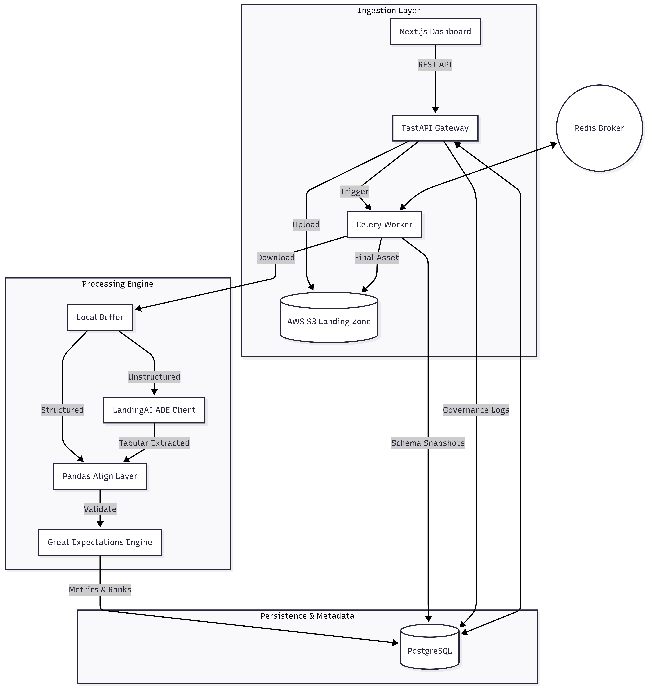

# CLEAN Framework: Technical Specification
### Data Quality Governance and RAG Extraction 

The CLEAN Framework is a specialized system for managing the lifecycle of diverse data assets. It automates the transition from unstructured document formats to validated, governed datasets through a distributed pipeline.

## System Architecture

The framework is built on a decoupled architecture using FastAPI for API routing, Celery for task orchestration, and AWS S3 as the primary data lake.



## Component Deep Dive

### 1. Ingestion Layer
The entry point for all data operations, managing the lifecycle of incoming datasets from various sources.
*   **Data Streaming**: Facilitates secure multi-part uploads directly to cloud storage. It implements strict validation on file sizes and automatically categorizes assets into organized storage prefixes based on format.
*   **External Connectivity**: Includes specialized adapters for third-party APIs. These components fetch external data, serialize the payloads, and persist them to the landing zone before initiating the processing pipeline.
*   **Asynchronous Tracking**: Interfaces with the message broker to provide real-time updates on background task progression.
*   **Data Access Interface**: Provides high-performance endpoints for reading raw storage objects and converting them into structured formats for interactive exploration.

### 2. Task Orchestration
A distributed processing system that manages the lifecycle of ingested files across a scalable worker cluster.
*   **State Management**: Tracks and broadcasts the status of each pipeline stage: from initial download to final validation: ensuring end-to-end observability.
*   **Dynamic Routing**: Automatically detects file types to determine the optimal processing path. Unstructured documents are routed through vision-based extraction, while structured datasets proceed directly to alignment.
*   **Transaction Integrity**: Ensures every execution is recorded, maintaining a consistent state and logging failures for rapid troubleshooting.

### 3. Data Extraction & Alignment
The core transformation engine that converts raw inputs into standardized datasets.
*   **Intelligent Parsing**: Utilizes vision models to extract structured key-value pairs and tabular data from unstructured sources. It also generates searchable text artifacts to facilitate full-text indexing.
*   **Structural Optimization**: Employs hashing algorithms to detect structural consistency. If a dataset's structure remains unchanged, the system optimizes performance by utilizing cached metadata.
*   **Normalization Engine**: A multi-stage transformation module that performs heuristic date standardization, column aliasing to match internal naming conventions, and semantic value mapping to ensure consistency across the data lake.

### 4. Validation & Quality Control
A rigorous quality assurance engine that enforces data integrity and compliance.
*   **Dynamic Rule Generation**: Automatically constructs validation suites in memory based on the detected dataset structure, ensuring rules remain aligned with the data without manual intervention.
*   **Statistical Analysis**: Implements advanced outlier detection to identify values that deviate significantly from expected statistical norms.
*   **Structural Integrity Checks**: Uses pattern matching to identify missing values, whitespace-only fields, and non-standard placeholders that would otherwise bypass traditional null checks.
*   **Quality Gating**: Evaluates assets against configurable thresholds, assigning health ranks and determining whether a dataset should be rejected or flagged for manual review.

### 5. Data Governance & Audit
The persistence and compliance layer that maintains a complete history of the data landscape.
*   **Change Tracking**: Records an immutable audit trail of every manual data modification, including the identity of the editor and the justification for the change.
*   **Metadata Versioning**: Maintains a versioned history of every asset's structure, enabling the detection and reporting of structural changes over time.

### 6. Observability Interface
A responsive dashboard designed for real-time monitoring and interactive data management.
*   **Pipeline Visualization**: Provides a recursive status-tracking interface that allows users to monitor the health of ingestion tasks as they progress.
*   **Interactive Exploration**: Features a custom-built data grid that enables direct cell editing with integrated serialization back to the core storage layer.
*   **Analytical Reporting**: Leverages integrated visualization tools to present quality trends and health distributions across all registered data assets.


## Detailed Data Flow

1.  **Ingest**: User uploads `invoice.pdf` via the Dashboard.
2.  **Land**: FastAPI saves the file to `s3://bucket/uploads/documents/` and triggers a Celery task.
3.  **Extract**: Celery downloads the file; LandingAI parses it into a structured CSV.
4.  **Align**: The ALIGN layer renames extracted columns (e.g., `Total Amount` -> `total_amount`) and tidies the data.
5.  **Validate**: Great Expectations runs a suite of 10+ rules. It finds a duplicate row and 2 missing values.
6.  **Persist**: The quality score (80%) and rank (B) are saved to PostgreSQL. The extracted CSV is saved back to S3.
7.  **Govern**: The user sees the rank B, opens the Data Explorer, fixes the missing values, and saves with the note "Manual correction of extraction error."


## Data Quality Scoring

The quality scoring model is designed to be transparent and configurable. The composite score is computed as follows:

```
Base Score    = (Passing GX Expectations / Total GX Expectations) × 100
Outlier Penalty = min(outlier_count × 2, 20)          # capped at 20 points
Hidden Null Penalty = min(hidden_null_count × 1, 10)  # capped at 10 points

Final Score = max(Base Score - Outlier Penalty - Hidden Null Penalty, 0)
```


## Technical Stack

*   **Backend**: Python 3.12, FastAPI, Celery, SQLAlchemy, Pandas, Great Expectations.
*   **Frontend**: Next.js 14, TypeScript, TailwindCSS, Recharts, Lucide-React.
*   **Infrastructure**: AWS S3, Redis (Broker), PostgreSQL (Metadata).
*   **Intelligence**: LandingAI ADE (Computer Vision).


## Installation and Setup

### Prerequisites

Ensure the following are available on your system before proceeding:

- Python 3.12+
- Node.js 18+ and npm
- Redis Server (running on `localhost:6379`)
- PostgreSQL 15+ database
- AWS account with S3 bucket and IAM credentials (S3 read/write permissions)
- LandingAI API Key (for document extraction)

### Environment Configuration

Copy the example environment file and populate all required values:

```bash
cd mvp
cp .env.example .env
```

The `.env` file requires the following variables:

```env
# AWS Configuration
AWS_ACCESS_KEY_ID=your_access_key_id
AWS_SECRET_ACCESS_KEY=your_secret_access_key
AWS_DEFAULT_REGION=eu-west-2
S3_BUCKET_NAME=your_bucket_name

# LandingAI Configuration
VISION_AGENT_API_KEY=your_landing_ai_key

# Database Configuration
DATABASE_URL=postgresql://*** 


# External APIs (optional)
ALPHA_VANTAGE_API_KEY=your_alpha_vantage_key 
```

### Backend Setup

```bash
# Navigate to the backend directory
cd mvp

# Install Python dependencies
pip install -r requirements.txt

# Initialise the PostgreSQL database (runs SQLAlchemy migrations)
python -c "from models import Base, engine; Base.metadata.create_all(engine)"

# Start the FastAPI server
python api.py
# API available at http://localhost:8000
# Interactive docs at http://localhost:8000/docs
```

### Worker Setup

The Celery worker must be started in a separate terminal process:

```bash
cd mvp

# Start Celery worker with info-level logging
celery -A worker worker --loglevel=info

# For production, use concurrency flag:
celery -A worker worker --loglevel=info --concurrency=4
```

### Frontend Setup

```bash
cd mvp/clean-frontend

# Install Node dependencies
npm install

# Start the Next.js development server
npm run dev
# Dashboard available at http://localhost:3000

# For production build:
npm run build && npm start
```

## Containerized Deployment (Docker)

The CLEAN Framework includes a `docker-compose.yml` configuration for spinning up the core backend infrastructure (API, Worker, and Redis) without manual dependency installation.

### 1. Build and Start Containers
```bash
cd mvp
docker-compose up --build
```
This will:
- Pull and start a **Redis** instance for task brokering.
- Build the **FastAPI** image and start the server on port `8001`.
- Build and start the **Celery Worker** with the necessary environment.

### 2. Accessing the Services
- **API**: `http://localhost:8001`
- **Documentation**: `http://localhost:8001/docs`

> [!NOTE]
> The frontend application currently runs outside of the Docker compose environment. Follow the **Frontend Setup** instructions above to start the dashboard.

## Design Decisions

**Why Celery over FastAPI background tasks?**
FastAPI's built-in `BackgroundTasks` runs in the same process as the API server. For compute-heavy operations like AI document extraction, this would block the API under load. Celery workers are fully decoupled and can be scaled independently across multiple machines.

**Why Great Expectations over custom validation?**
Great Expectations provides a rich, standardised vocabulary for data quality rules that aligns directly with industry practice. Its expectation result format includes machine-readable pass/fail metadata that integrates cleanly with the scoring model. Writing equivalent custom validation logic would replicate significant functionality without the ecosystem benefits.

**Why S3 as the data lake rather than direct PostgreSQL storage?**
Raw and processed files can be arbitrarily large and diverse in format. S3 provides cost-effective object storage with versioning, lifecycle policies, and direct streaming support. PostgreSQL is reserved for structured metadata and quality scores only, keeping the database schema stable and query performance predictable.

**Why dynamic expectation suites rather than static files?**
Static expectation files require manual maintenance as schemas evolve. Dynamic generation from inferred schemas ensures validation rules always reflect the current asset structure, reducing operational overhead and eliminating the risk of stale validation configurations.